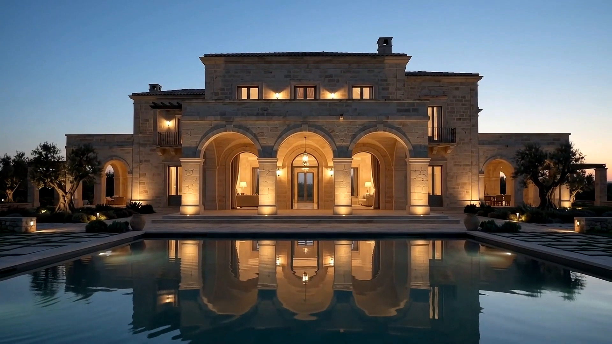

# OMNIS — Private Mediterranean Residence



OMNIS is a cinematic, editorial website concept for an ultra-luxury Mediterranean residence. The experience combines scroll-controlled architectural films, restrained typography, immersive photography, and responsive storytelling across desktop and mobile.

## Experience

- Scroll-driven canvas hero built from image sequences rather than autoplay video
- Finalized homepage Film 02, without film selectors
- On-demand interactive conceptual 3D estate with courtyard, salon and terrace viewpoints
- Accessible photographic galleries for all three signature spaces
- Responsive desktop and mobile compositions
- Animated architectural, interior, signature-space, location, and enquiry chapters
- Accessible navigation, reduced-motion support, semantic content, and keyboard-friendly controls
- A 41-frame Film 02 sequence with preloaded poster, progressive decoding and native sticky scrolling

## Hero films

| Film | Sequence |
| --- | --- |
| 01 | Vertical crane — palace façade to reflecting water |
| 02 | Exterior architecture |
| 03 | Aerial coastal residence |
| 04 | Grand salon |
| 05 | Courtyard dining |
| 06 | Blue-hour exterior |
| 07 | Mediterranean bedroom |
| 08 | Primary suite |
| 09 | Architectural craftsmanship |
| 10 | Mediterranean entrance glide |

The asset library contains ten source films. The finalized homepage exclusively uses Film 02 and has no film selectors. Legacy variant links also render Film 02.

## Technology

- React
- TypeScript
- Vite
- GSAP and ScrollTrigger
- HTML Canvas for frame-sequence rendering
- Three.js for the lazily loaded architectural study
- Sharp for desktop/mobile WebP generation
- Playwright for Chromium, Firefox and mobile WebKit verification

## Local development

Requirements: a current Node.js LTS release and npm.

```bash
npm install
npm run dev
```

The development server is available at `http://localhost:5173` by default.

## Production build

```bash
npm run build
npm run preview
```

The build command compresses used assets into desktop/mobile WebP images, regenerates the Film 02 manifest, prepares domain metadata, runs the TypeScript compiler, and creates production output in `dist`. Unselected sequences and original image directories are excluded from the release; workspace sources are preserved. The hero uses native sticky positioning, a viewport-specific preloaded poster, 41 compressed frames and two low-priority requests at a time. Decoded ImageBitmaps are retained for reverse scrolling where supported, with HTML images as a fallback. Canvas size is cached on resize, desktop resolution is bounded by the source detail, and mobile device pixel ratio is capped at one. Data-saver, 2G and reduced-motion visitors receive a static poster with ordinary scrolling.

## Verification and deployment

```bash
npx playwright install
npm run build
npm test
```

The browser suite covers the finalized Film 02 homepage and legacy variant links, every navigation destination, all gallery photographs, focus restoration, responsive widths, reduced motion, enquiry validation and demo confirmation, 3D controls, WebGL fallback, privacy and metadata. See [DEPLOYMENT.md](DEPLOYMENT.md) for static hosting, HTTPS/domain configuration and the `SITE_URL` setting that generates canonical URLs and a sitemap. No final domain is assumed.

For a reproducible Chromium performance profile, run a production preview and `node scripts/profile-performance.mjs http://localhost:4173 comparison`. Set `PROFILE_CPU_THROTTLE=4` for CPU throttling; the script uses a cold cache, 4 Mbps throughput and 80 ms latency. The default measurement begins after 10 seconds of preparation; set `PROFILE_WARMUP_MS=0` to measure scrolling immediately after the document loads. Reports live in ignored `performance-results`. Emulation measures loading and actual hero drawing but does not replace real-device or deployed-origin testing.

## Asset structure

The repository includes the complete visual library, so no separate asset import is required.

```text
New folder/                 Original source image sequences
public/campaign/            Curated campaign and section imagery
public/optimized/           Generated WebP variants (not committed)
public/hero-film-*/         Browser-ready hero sequences
public/hero-frames-vertical Default Film 01 sequence
public/palace-details/      Architectural detail stills
public/variations/          Additional residence perspectives
```

`scripts/generate-frame-manifest.mjs` scans the configured hero directories and generates `src/lib/frameManifest.generated.ts`. Run `npm run optimize` and then `npm run frames` whenever source images change. Development and production builds do this automatically.

## Project structure

```text
src/components/             Page sections and navigation
src/hooks/                  Shared React hooks
src/lib/                    Generated frame metadata
src/styles/global.css       Visual system and responsive layout
scripts/                    Build-time utilities
public/                     Production-ready visual assets
```

## Notes

- The visual assets are intentionally committed to the repository for a self-contained checkout.
- `node_modules`, `dist`, TypeScript build caches, and local logs are excluded from version control.
- OMNIS is presented as a conceptual luxury-residence experience.
- The 3D model is an illustrative interpretation, not a measured replica. Exact property specifications and location remain unconfirmed.
- The displayed contact number is explicitly dummy. The enquiry form remains a local demonstration and does not send or store submissions.
